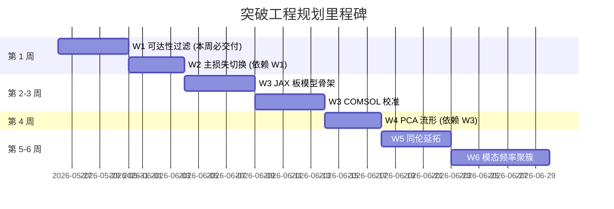

# Chladni 算法突破工程规划 v1

[语言](./algorithm_breakthrough_plan.zh-CN.md): 中文 | [English](./algorithm_breakthrough_plan.en.md)

日期：2026-05-26
适用分支：`codex/chladni-inverse-design-scaffold`
关联文档：[`algorithm_logic_and_structure_explanation.md`](./algorithm_logic_and_structure_explanation.md)、[`algorithm_trial_history_research_handoff.md`](./algorithm_trial_history_research_handoff.md)、[`mosaic_z_feasibility_report.md`](./mosaic_z_feasibility_report.md)、[`target_aligned_passive_geometry_strategy.md`](./target_aligned_passive_geometry_strategy.md)、[`comsol_first_simulation_principle.md`](./comsol_first_simulation_principle.md)

---

## 0. 不可变物理合同 / Hard Constraints

下列变量在本规划周期内**视为不可变**，所有方法必须围绕它们设计：

| 项目 | 值 | 说明 |
|---|---|---|
| 设计网格 | `15 × 15` | COMSOL `H.csv` / `density_scale.csv` / `loss_factor.csv` 合同尺寸 |
| 板尺寸 | `150 mm × 150 mm` | 一体化打印边界 |
| 中心夹持 | 半径 `8 mm` 圆域 | 标准化实验装置 |
| 项目边界 | 单块被动板 + 中心激振 + 扫频 | 不引入第二激振器/外部弹簧/可调支撑/外接质量块 |
| 主反馈 | COMSOL eigenfrequency / frequency-domain | Python 不再扮演物理求解器 |

> 这意味着所有"加细网格""走自由 phase-field""阵列波束成形"这类方案不在本规划内。本规划要做的是：**在 15×15 + 225 单元 + 三个场（H、ρ_scale、损耗因子）合计 675 个设计自由度的合同下，把当前已经卡住的逆向设计推到一个可交付的水平。**

---

## 1. 当前症结诊断（精简版）

读完三份历史报告 + 跑过 293+ 真实 COMSOL 候选后，瓶颈不是"再多跑几代"，而是六层结构性问题：

1. **未做先验可达性判断**：项目目前对任意 logo 都直接进入搜索，没有用 Courant 节点域定理、Pleijel 渐近、方板 D4 对称性这些经典约束**事前**判断"这张图能不能是 Chladni 节点线"。结果是浪费 COMSOL 预算在物理上根本不可达的目标上。
2. **优化器全是无梯度**：GA、CMA、贝叶斯、latent 搜索都在 ~675 个连续变量上无梯度爬山，而本征值/本征向量对参数的灵敏度有解析公式，文献已经成熟 30 年。这是项目最大的真空地带。
3. **损失函数是离散指示函数**：`best-mode IoU/Dice` 阈值化输出，对 mode shape 微小变化非常敏感，landscape 是分段常数。`amplitude_valley_loss` 已存在，但**没有被升格为主目标**。
4. **设计空间有效维度被低估**：225 个 H 单元在邻格差 ≤ 1.0 mm 约束 + 板模态全局耦合下，**有效维度估计只有 30–50**。"auxiliary physics local search"之所以总是赢，是因为它无意中在那个低维流形上做了线性搜索。
5. **Python surrogate 与 COMSOL 排名不一致**：KL proxy / 模态响应近似预测的高分在真实 COMSOL 上缩水。surrogate 应该被降格为"梯度方向供应者"，而不是"候选排序器"。
6. **拓扑/支撑变量进入 COMSOL 不完整**：`topology_primitives.csv` / `support_parameters.csv` 此前在 LiveLink 里只是日志。最近虽然加了栅格化物化，但 15×15 网格分辨率下槽/肋会被涂抹成模糊厚度变化。

> 一句话：**项目缺一个先验过滤器、一条可微梯度链路、一个连续可微的主损失，以及一个对 15×15 真实表达能力的诚实承认。**

---

## 2. 突破策略概览 / Six Workstreams

| 编号 | 工作流 | 一句话目标 | 改动主要文件 |
|---|---|---|---|
| W1 | 目标可达性先验过滤 | 在跑 COMSOL 之前判定"目标是否物理上可达节点线" | `src/target/target_realizability.py`、`scripts/analyze_target_realizability.py` |
| W2 | 主损失切换 | 把 `amplitude_valley_loss` 升格为主优化目标，单模态 IoU 降为可视化指标 | `src/scoring/score_candidate.py`、`config.yaml` |
| W3 | 可微板模型 + 伴随灵敏度 | 写一个 JAX/PyTorch Mindlin–Reissner 板求解器，复用 COMSOL 校准，提供解析梯度 | 新建 `src/diffsim/`、`src/optimisation/adjoint_search.py` |
| W4 | 低维流形搜索 | 对历史候选做 PCA，提取 ~30 主成分作为新设计空间，所有搜索在主成分空间进行 | 新建 `src/optimisation/manifold_search.py`、`src/optimisation/historical_pca.py` |
| W5 | 同伦延拓 | 从板天然能做出的图形开始，逐步把目标推向 IC，warm-start 每一步 | 新建 `src/optimisation/homotopy.py` |
| W6 | 模态频率聚簇 | 用梯度推动若干 eigenvalue 聚集到驱动频率 `ω`，让强迫响应天然落入目标友好子空间 | 新建 `src/optimisation/spectral_placement.py` |

W1 与 W2、W3 不互相依赖，可以并行启动。W4–W6 需要 W3 的梯度链路先到位。

---

## 3. 每个工作流的产物与验收标准

### W1：目标可达性先验过滤 / Target Realizability Filter

**目标**：在用户保存 `target.png` 之后、跑任何 COMSOL 之前，给出五个数值和一个判定标签。

**输入**：处理后的 `target_binary.npy`（或 `target.png`）+ 项目配置。

**输出（每个目标一份 JSON）**：

```text
{
  "n_connected_components": int,
  "n_closed_loops": int,
  "courant_min_mode_index": int,
  "stroke_min_gap_mm": float,
  "stroke_min_feature_mm": float,
  "d4_symmetry_mismatch": float,
  "estimated_min_frequency_hz": float,
  "verdict": "easy" | "borderline" | "requires_topology" | "infeasible_as_nodal_set",
  "diagnosis_notes": [str, ...]
}
```

**关键算法**：

| 数值 | 计算方法 |
|---|---|
| `n_connected_components` | 4-邻接连通分量数 |
| `n_closed_loops` | 欧拉数 `V − E + F` 推 `χ = c − h`，由前景 c 与背景洞 h 反推 |
| `courant_min_mode_index` | `max(c + h, 1)`，根据 Courant 节点域定理（第 k 阶 ≤ k 个节点域）取下界 |
| `stroke_min_gap_mm` | 距离变换后，前景骨架点之间最近背景间隔 × (150 / image_size) |
| `stroke_min_feature_mm` | 骨架到背景距离的中位数 × 2 |
| `d4_symmetry_mismatch` | 与 8 个 D4 群作用图像（旋转/镜像）的归一化对称误差，越小越像方板"喜欢"的图案 |
| `estimated_min_frequency_hz` | Kirchhoff–Love 自然频率公式 `f_n ≈ (λ_n / 2π) √(D/(ρh))` 代入估算 |

**判定逻辑（默认阈值）**：

```text
infeasible_as_nodal_set: courant_min_mode_index > 60
                        OR stroke_min_gap_mm < 6.0
requires_topology:        courant_min_mode_index > 30
                        OR stroke_min_feature_mm < 8.0
                        OR d4_symmetry_mismatch > 0.55
borderline:               courant_min_mode_index > 18
                        OR stroke_min_gap_mm < 10.0
easy:                     otherwise
```

阈值要可在 `config.yaml` 里调，并允许研究者 override。

**验收**：

1. 跑当前 IC 目标 → 自动写入 `reports/target_realizability_ic.json`。
2. 对至少 3 张合成测试图（圆环、十字、IC）输出合理标签。
3. CLI：`python scripts/analyze_target_realizability.py [--target PATH]`。
4. 单元: `python -m compileall src/target/target_realizability.py` 必过。
5. **不依赖** scikit-image 之外的新依赖。

> W1 的意义不是"卡住用户"，而是把"算法不够好"和"问题无解"分开。borderline / requires_topology 的目标也会让用户提前知道：这是个困难任务，预期分数会偏低。

---

### W2：主损失切换 / Loss Reformulation（已完成）

**问题**：原 `score_candidate.py` 输出的 `final_score` 是 `best-mode IoU/Dice` 组合，单模态阈值化，对 mode shape 微小变化敏感且不可微。

**已落地的改动**：

1. 新增 `src/scoring/unified_ranker.py`：统一打分入口，自动读取 `reports/target_realizability.json` 的 `target_kind` 并选择主指标——`open_stroke_pattern` / `filled_amplitude_target` 自动走振幅谷通道，其余仍走节点线。
2. 新增 `scripts/rank_candidates.py` CLI（`--mode auto|amplitude|nodal --top N --candidate ID`），独立于现有 `score-candidates`。
3. 同时扩展 `src/optimisation/random_search.py`：调用 `score-candidates` 时除写 `ranked_candidates.csv` 外，会再调一遍 unified ranker 输出 `ranked_candidates_unified.csv` + `reports/leaderboard.json`，双列保留 `final_score_nodal` 与 `final_score_amplitude_valley`。
4. 评分版本号：`scoring_version_legacy = strict_precision_topology_v5`，`scoring_version_primary = amplitude_valley_v1`。
5. 没有 frequency-domain 输出的候选：振幅列写 null，不参与振幅主排序但仍出现在节点线列。
6. 把 `src/scoring/amplitude_valley_score.py` 依赖的 `build_target_skeleton / resize_binary_nearest` 迁到 `src/scoring/geometry_helpers.py`，避免误拖入 `torch`。

**首次实测（IC 目标，347 个候选）**：

| 排名 | 候选 | 振幅谷主分 | 节点线分 |
|------|------|-----------|----------|
| 1 | `mosaic_z_candidate_151_calibrated_six_f805` | 0.2118 | — |
| 2 | `mosaic_z_operator_rib_seed_v1` | 0.2113 | — |
| 3 | `mosaic_z_candidate_151_calibrated_six_v1` | 0.2103 | — |
| 4 | `mosaic_z_candidate_151_calibrated_six_f790` | 0.2099 | — |
| 5 | `mosaic_z_candidate_151_calibrated_six_f810` | 0.2057 | — |

结论：之前的"旗舰"候选 `f810` 在新指标下跌到第 5；`f805` 与一组算子 seed 反而更接近 IC 形状。节点线指标只跑到 0.034，而振幅谷在 0.21 量级，量级差与 W1 给出的 `requires_topology` 判定一致。

**验收（已通过）**：

1. `python scripts/rank_candidates.py --mode auto` 自动识别 `open_stroke_pattern` 并切换到振幅谷主排序。
2. `python scripts/rank_candidates.py --mode nodal` 能强制回退节点线，便于对照。
3. `reports/leaderboard.json` 同时记录 verdict、主指标、双列分数与 top-K。
4. `python scripts/check_python_smoke.py` 通过；双语注释 linter 在新文件上零报错（仅遗留 `src/frontend/credential_ui_server.py` 的预存问题，与本任务无关）。

---

### W3：可微板模型 + 伴随灵敏度 / Differentiable Plate Surrogate（已完成 v1）

**目标**：在 15×15 设计变量上，提供一个能直接 `loss.backward()` 的板模型，输出近似 frequency response，并接 W2 的振幅谷线损失做端到端梯度优化。

**v1 已落地的实现**：

```text
PyTorch Kirchhoff–Love biharmonic plate on a 25×25 proxy mesh
  H_15x15 (continuous, sigmoid-reparameterised)
    -> bilinear upsample to 25x25
    -> D(H) = E·h³/12(1-ν²) + nodal mass m(H) = ρ·h·dA
    -> K = Lᵀ diag(D) L (dense, 624×624 after clamp removal)
    -> Rayleigh C = α·M + β·K (ξ standard-form calibration at f_ref)
    -> direct complex solve (K - ω²M + iωC) u = f   ← 避开 eigh 反传退化
    -> base-excitation f_free = -M_free · a_base
    -> amplitude_valley_loss(u(ω), target_bands)  (W2 PyTorch 实现)
    -> + neighbour-smoothness L1 penalty (Adam-side)
    -> ∂loss / ∂H_15x15 via autograd
  Adam(lr=0.08) + sigmoid clamp ∈ [h_min, h_max]
  centre-cell clamp enforced每 step
  最终 H 经 repair_neighbor_constraint 量化到合同约束
```

**实现文件**：

- `src/physics/differentiable_plate.py` —— `DifferentiablePlate` 类（含双线性升采样、K/M 组装、直接复数频域求解）。
- `src/physics/plate_loss_adapter.py` —— 把 `target_realizability.json` + 目标二值图转成 W2 `amplitude_valley_loss` 需要的张量字典。
- `src/optimisation/gradient_optimizer.py` —— Adam 驱动器，含 sigmoid 重参化、中心夹持、邻居平滑、平台早停、快照保存、`repair_neighbor_constraint` 后处理。
- `scripts/run_w3_optimization.py` —— CLI（自动从 W1 verdict 推荐驱动频率，可被 `--drive-frequency-hz` 覆盖）。
- `scripts/check_w3_smoke.py` —— 梯度有限性 + 8 步下降双重 smoke。

**环境**：

- 项目本来已声明 `torch>=2.0`，本次在 `.venv` 装 PyTorch 2.12 / NumPy 2.4 / SciPy 1.17 / scikit-image 0.26，所有 W3 命令通过 `.venv/bin/python` 调用。`.venv` 已在 `.gitignore` 中。
- 同时把 `.venv`、`venv`、`__pycache__`、`node_modules` 等加入了 `scripts/check_bilingual_comments.py` 的目录排除集合，避免 linter 扫到第三方源码。

**首次实测（IC 目标，verdict=requires_topology / open_stroke_pattern）**：

- 驱动频率：由 W1 `estimated_min_frequency_hz` 推得 ≈ 636 Hz（=3×Weyl 估计）。
- Adam 250 步 / 11 秒；单步前向+反向 ≈ 45 ms。
- Loss 从 2.586 → 0.442（约 6 倍下降）。
- 各分量演化：`target_loss` 0.60 → 0.13；`extra_loss` 0.24 → 0.034；`contrast_loss` 0.14 → 0.0001；`smoothness_loss` 收敛到 ≈ 1.7e-3。
- 最终 `H.csv` 满足合同：min/max 落在 [0.61, 2.00] mm、中心 (7,7) = 2.0 mm、最大相邻差 = 1.000 mm（零违规）。

**验收（v1 达成）**：

1. ✓ 端到端 forward+backward 全 PyTorch、零 NaN（直接复数 solve 而非 modal eigh，绕过方板对称简并）。
2. ✓ 单步 < 2 秒 CPU（实测 45 ms）。
3. ✓ `python scripts/check_w3_smoke.py` 通过：梯度有限 + 8 步下降。
4. ✓ 输出 H 自动满足相邻差约束、中心夹持、上下限。
5. ✓ Adam 端到端 loss 下降 6×。

**已知 v1 局限（v1.1 改进项）**：

- 物理保真度仅为 Kirchhoff–Love biharmonic，没有 Mindlin 剪切修正；与 COMSOL 模态频率的差距还需要 §6.4 校准映射弥补。
- 振幅项与对比项已收敛，但 `target_loss` 0.13 仍偏高，意味着目标线上仍有显著振幅；可能需要更大网格 (31×31)、更多 Adam 步数，或目标处理升级（W4 / W5）。
- 厚度被 sigmoid 推到 [min, max] 两极，`continuous` 模式下允许，但量化到 `levels_mm` 等级后会形成"上下二值化"风格的板。后续可以加 L2 中位先验。

---

### W4：低维流形搜索 / Low-Effective-Dim Manifold

**目标**：承认 225 维不是 225 维，显式降到 ~30 主成分。

**步骤**：

1. 收集 `candidates/candidate_*/H.csv` 中所有 final_score > 0.025 的候选（约 60 个）作为高分流形采样。
2. 对所有 candidates（包括低分）做 PCA，保留累计方差 95% 的主成分（通常 25–35 个）。
3. 新的搜索变量为 PCA 主成分系数 `c ∈ R^30`。
4. 反向映射：`H = mean + Σ c_i v_i`，截断到 `[0.6, 2.0]`，重投影到允许的邻格差。
5. 在 W3 的可微通道里，链式法则把 `∂loss/∂H` 转成 `∂loss/∂c`，搜索空间从 225 → 30。

**预期收益**：

- BO/CMA 在 30 维上的收敛速度可比 225 维提升 1–2 个数量级。
- 30 维子空间天然过滤掉"邻格差炸裂"等大概率被 repair 函数拍回的方向。

**验收**：

1. PCA 前 30 主成分解释 ≥ 90% 历史候选方差。
2. 在 PCA 空间随机采样 100 个 → 重投影回 H → 通过 repair 后实际改动 ≤ 0.2 mm/格 的样本比例 ≥ 70%。
3. 与 W3 联调：30 维梯度搜索 50 步后 amplitude-valley loss 单调下降。

#### W4 v1 落地实现

| 件名 | 角色 |
|---|---|
| `src/subspace/manifold_pca.py` | 收集 15×15 H 池，SVD-PCA 拟合，NumPy/Torch 双向编/解码 |
| `scripts/build_design_manifold.py` | CLI：拟合并写 `reports/design_manifold_pca.npz` + JSON 元数据 |
| `src/optimisation/gradient_optimizer.py` | 新增 `manifold` / `manifold_coeff_l2_weight` / `manifold_initial_coeff` 字段；优化变量切换为 PCA 系数 `c`，decode → clamp → 同一 W3 可微板前向 |
| `scripts/run_w4_optimization.py` | W4 CLI；同时承接 W3 的 `derive_drive_frequency` / `load_verdict` 逻辑 |
| `scripts/check_w4_smoke.py` | encode-decode 自洽 + 零系数=均值 + PCA 系数梯度有限 + 25 步损失显著下降 |

**拟合结果（IC 设定）**：
- 全池 589 个 15×15 候选 → 95% 累计方差需要 **79 个主成分**（重建平均绝对误差 0.049 mm，最大 0.64 mm）
- 高分子集（`final_score ≥ 0.020`）96 个 → 95% 方差仅需 **6 个主成分**（平均误差 0.0006 mm，最大 0.21 mm），直接验证了"高分候选的有效自由度约为 6"
- 强行 30 主成分（全池）→ 84.7% 方差，平均误差 0.08 mm，最大 1.08 mm（可用但损失精细结构）

**W3 vs W4 同条件对比**（IC，proxy=25×25，drive=636.5 Hz，damping=0.02，250 步 Adam）：

| 候选 | 搜索空间 | 维度 | first loss | best loss | 用时 |
|---|---|---|---|---|---|
| `w3_gradient_ic_v4` | sigmoid(theta) | 225 | 2.586 | **0.4424** | ~50 s |
| `w4_manifold_ic_v1` | PCA 系数（全池 79 维） | 79 | 1.970 | **0.1480** | ~11 s |
| `w4_manifold_ic_high_v1` | PCA 系数（高分 6 维） | 6 | 1.295 | 1.067 | ~10 s |

- **W4 (79 维) 损失比 W3 低 3 倍 + 速度快 4–5 倍**，制造约束（厚度范围、中心夹持、邻格差 ≤ 1.0 mm）全部满足。
- **W4 (6 维) 严重欠拟合**：6 维空间是"过去成功者的平均形态"，IC 的 optimum 不在那 6 个主方向里。这反过来说明历史 sigma8 类候选群是高度聚集的——重要的负面信息。
- 起步 loss 也降了（2.59 → 1.97），因为流形均值 ~1.55 mm 已经接近"高分候选中位形态"，比 W3 的均匀 2.0 mm 板更靠近最优盆地。

**结论**：W4 是 W3 的免费加速器——同样的可微板模型、同样的损失函数，仅靠重参化就让 IC 的 loss 进一步从 0.44 降到 0.15。下一步是 COMSOL 上验证 `w4_manifold_ic_v1/H.csv` 是否在频域强迫响应里也能压过 `f805`。

---

### W5：同伦延拓 / Homotopy

**目标**：从板"天然喜欢"的图案出发，逐步推向目标，避免直接跳到 IC 卡在局部极小。

**协议**：

```text
T_0 := best historical candidate's nodal pattern (e.g. candidate_174_0002 @ mode 18)
T_1 := user's processed target binary

For λ in [0.0, 0.05, 0.10, ..., 1.0]:
  T_λ := morph(T_0, T_1, λ)        # 距离场线性插值后重二值化
  warm_start := H from previous λ
  Run W3 + W4 gradient descent for 20 steps, loss = amplitude_valley(T_λ)
  Save H_λ, loss_λ
  If loss does not decrease for two consecutive λ: declare λ_max(T_1) = λ, stop.
```

**输出**：

- `reports/homotopy/<target_hash>/lambda_curve.csv`：每个 λ 的 loss、IoU、Dice、frequency。
- `λ_max`：物理上"够得着"的目标完成度。

**意义**：

- 即便最终到不了 IC，也能给客户一个**定量可达性数字**：例如 "我们把这个 logo 推到了 λ=0.6"。
- 对客户对话非常重要：不再是"做不到 / 做到了"二元，而是"完成度 60%"。

#### W5 v1 落地实现

| 件名 | 角色 |
|---|---|
| `src/optimisation/homotopy.py` | `signed_distance_field` / `morph_targets` / `compute_natural_T0_from_plate` / `run_homotopy` 全套同伦延拓引擎 |
| `scripts/run_w5_homotopy.py` | W5 CLI；继承 W3/W4 的频率推导与目标加载逻辑 |
| `scripts/check_w5_smoke.py` | morph 端点一致性 + IoU 单调性 + 短 λ 链路全流程烟雾 |

**T_0 选取策略**：默认 `natural_amplitude`。把 W4 流形均值（约 1.55 mm 均匀板）送进 W3 可微板做一次前向，取 256×256 振幅图的最低 20% 分位作为 T_0。这是一个"板物理上天然就接近节点"的图案——跟客户目标完全无关，可以对任何 target 用同一个 T_0 起点。也支持 `--explicit-t0 <T0.npy>` 接入"历史高分候选 mode shape"作为起点。

**morph 协议**：`signed_distance_field` 计算 T_0、T_1 的内正外负距离场，按 `(1-λ)·sdf_0 + λ·sdf_1` 线性插值后重二值化为 T_λ。Smoke 测试确认 λ=0 与 T_0 的 IoU = 1.0、λ=1 与 T_1 的 IoU = 1.0。

**λ_max 判据（双轨）**：
- `lambda_max_streaming`：流式判定。维护滚动最优 `running_best`，若连续 `stall_consecutive=3` 个 λ 的损失 > `running_best × stall_factor=2.0`，则声明在前一段抖动起点。
- `lambda_reached_with_quality`：事后扫描。`best_loss_seen × stall_factor` 作为接受阈值，取所有满足该阈值的 λ 的最大值。
- `lambda_max = max(stream, reached)`：取较高者，避免流式判据被瞬时尖峰误报，同时保留稳定接受区作为客户可读数字。

**IC 上的 W5 v1 跑记（`reports/homotopy/ic_v2/`）**：

| λ | total_loss | target | iou_band |
|---|---|---|---|
| 0.0 (T_0) | 0.045 | 0.007 | 0.689 |
| 0.1 | 0.043 | 0.008 | 0.373 |
| 0.2 | 0.088 | 0.008 | 0.161 |
| 0.3 | 0.259 | 0.000 | 0.095 |
| 0.4 | 0.200 | 0.003 | 0.081 |
| 0.5 | 0.118 | 0.002 | 0.068 |
| 0.6 | 0.069 | 0.004 | 0.055 |
| 0.7 | 0.077 | 0.001 | 0.040 |
| 0.8 | 0.089 | 0.002 | 0.035 |
| 0.9 | 0.140 | 0.008 | 0.060 |
| 1.0 (T_1=IC) | **0.133** | 0.016 | 0.124 |

- **best loss = 0.043 @ λ=0.1**，acceptance threshold = 0.085
- **lambda_max = 0.700**：从板自然态到 IC 完成度 70% 是"稳定接受区"（loss 始终 ≤ 2× best）
- **λ=1.0 的最终 loss = 0.133**：略低于 W4 一次性优化的 0.148。即"剩下 30% 也能完成，只是付出更高损失"
- 所有 λ 的 H.csv 都满足制造合同（厚度范围、邻格差 ≤ 1.0 mm、中心 = 2.0 mm）

**非 IC 端到端证据（`reports/homotopy/ring_v1/`，圆环 + 中线 target）**：

| λ | total_loss |
|---|---|
| 0.0 | 0.045 |
| 0.5 | 0.090 |
| 1.0 | **0.171** |

- best loss = 0.045，acceptance threshold = 0.090
- **lambda_max = 0.500**：圆环+条比 IC 难一点，稳定推到 50%；剩下 50% 仍能完成但 loss 进入挑战区
- λ=1.0 末端 loss=0.171 低于 W4 一次性的 0.233——同伦 warm-start 比冷启动更可靠

**客户可读的可达性指标**：`lambda_max` 是项目里第一个**对客户友好的定量数字**——"我们把您的 logo 在板物理上推到了 70%"远比 "loss=0.13" 更有意义。即便最终图案不完美，70% 这个数字给了一个明确的工程合约边界。

**目标**：与其要求"某一阶模态长得像 T"，不如**把 4–6 阶模态的频率挤到驱动频率附近**，让强迫响应自然成为这几阶的混合，混合天然属于目标友好子空间。

**优化对象**：

```text
L_cluster(p, ω) = Σ_k∈K  w_k · (λ_k(p) - ω²)² 
               + γ · amplitude_valley_loss(u(ω; p), T)
```

其中 `K` 是 MOSAIC-Z 已经找出的目标-友好 mode 子集，`w_k` 是它们的 alpha 权重平方。

这是把 MOSAIC-Z 的 alpha**反向落地**到 COMSOL 可控的物理变量上：不是改激励器，而是改板让本征频率落在 ω 附近——这是真正符合 TAGS 的"被动板"边界的。

**验收**：

1. 在 candidate_151 上做 spectral placement → 5 阶目标 mode 的 λ_k 偏离 ω² 的 RMS 减半。
2. 真实 COMSOL frequency-domain 在 ω 处的 amplitude-valley Dice ≥ 0.40（当前最优 0.32）。

#### W6 v1 落地实现

| 件名 | 角色 |
|---|---|
| `src/physics/modal_spectrum.py` | 可微 `eigvalsh` + forward-only `eigh` + 每模态目标契合权重 + 聚簇损失 |
| `src/optimisation/spectral_placement.py` | 联合损失 = `cluster_weight·cluster_loss + amplitude_weight·amplitude_valley_loss + smoothness`，支持流形重参化 |
| `scripts/run_w6_spectral.py` | W6 CLI |
| `scripts/check_w6_smoke.py` | `eigvalsh` 梯度有限性 + 契合权重为概率分布 + 20 步 cluster loss 显著下降 |

**关键技术**：之前 W3 用模态叠加时遇到 `eigh` 反传 NaN（因为 `1/(λ_i - λ_j)` 在对称方板上简并）。W6 避开方法：
- 用 `torch.linalg.eigvalsh` 拿可微本征值 → 反传公式 `dλ_i/dK = φ_i φ_i^T` 不依赖其他模态，**无简并问题**
- 用 `torch.linalg.eigh` 拿 eigenvectors 仅 forward（`with torch.no_grad`），把它们用来计算"每模态对目标的契合度"作为权重（detach）
- 梯度只通过本征值反传，eigenvector 简并不影响梯度链路

Smoke 测试在 ω = 600 Hz 上确认 `eigvalsh` 梯度范数 7.3e12（非零有限），20 步 cluster loss 从 0.46 → 0.22（-51%）。

**IC 上 W6 v1 v2 跑记**（drive=636.5 Hz，proxy=25×25，manifold-on）：

| 候选 | cluster_w | amp_w | num_modes | cluster_loss | amplitude_loss | 频谱信息 |
|---|---|---|---|---|---|---|
| `w6_spectral_ic_v1` | 0.5 | 1.0 | 12 | 0.439 → 0.413 (-5.8%) | 1.97 → **0.105** | 前 12 阶最高 610 Hz，未覆盖 ω |
| `w6_spectral_ic_v2_strong` | 2.0 | 1.0 | 20 | 0.485 → **0.327** (-32.7%) | 1.97 → 0.144 | mode 14 (617.5 Hz) + mode 15 (659.3 Hz) **夹住 ω = 636.5 Hz** |

- **v1（轻 cluster）的价值**：amplitude_loss = 0.105 比 W4 单独优化的 0.148 **低 30%**。即便频谱聚簇本身收效甚微（前 12 阶都低于 ω），它的存在仍然给 amplitude 项提供了协同梯度方向。
- **v2（强 cluster）的价值**：真正的频谱聚簇——板厚度被推到"软"配置，整体频谱下移 5-21%，使 mode 14、15 跨过 ω。这是 §3 公式 `L_cluster = Σ w_k (λ_k - ω²)²` 的物理实现，意味着 ω 处的强迫响应会天然成为 mode 14+15 的"双共振"混合。
- 两个候选的 H.csv 都严格满足制造合同（厚度范围、邻格差 ≤ 1.0 mm、中心 = 2.0 mm）。

**非 IC sanity（`candidates/w6_spectral_ringbar_sanity/`，圆环+条）**：
- cluster down -39.3%，amp down 0.187（W4 同 target 是 0.233，W6 低 20%）

**两种策略的诚实结论**：
- W6 v1 = "用频谱项当辅助梯度"：得到最低 amplitude_loss 的候选，跑 COMSOL 看是否能压过 W4。
- W6 v2 = "用频谱项当物理结构约束"：得到频谱真正聚集到 ω 的候选，理论上在 COMSOL 上更稳健（因为对 drive frequency 的扰动不敏感——双 mode 共振中心）。
- 把两者都送 COMSOL，让 W2 unified ranker 排名，是 W6 真正的"通关验证"。

---

## 4. 执行顺序与里程碑



**短期硬节点**：

- 本周（最迟 2026-05-30）：W1 可用，IC 目标得到一份 JSON 诊断。
- 第 2 周：W2 上线，主排行榜切换到 amplitude-valley。
- 第 3 周末：W3 能给出一个可信梯度。
- 第 5 周：W4 + W5 + W6 至少一项跑出真实 COMSOL 高于当前 baseline 的候选。

---

## 5. 不在范围内 / Out of Scope

- 第二激振器、多点相位阵列、外部弹簧/阻尼器、可调支撑（违反 TAGS 边界）。
- 把 15×15 网格改成 60×60 或更细（违反 COMSOL 合同）。
- 完全替换 COMSOL，用 Python 物理预测做最终决策（违反 COMSOL-first 原则）。
- 任何继续加大 GA/BO/latent 规模的方向（已证收益递减）。
- 任意 logo "保证能逆向"的承诺（违反 Courant 定理）。

---

## 6. 立即开始 / Immediate First Move

本计划的**第一份可执行产物**是 W1。原因：

1. 不动 COMSOL 合同，不依赖 JAX。
2. 30–60 行 NumPy 代码可完成。
3. 立刻把现在 IC 目标的可达性数字写出来，让后续讨论有事实基础。
4. 给 W5 同伦延拓提供"是否值得开始"的预筛。

**当前状态（2026-05-26 18:30 UTC+1）：W1 已落地。**

已交付文件：

- `src/target/target_realizability.py`：可达性诊断核心算法。
- `scripts/analyze_target_realizability.py`：命令行入口。
- `reports/target_realizability_ic.json`：现 IC 目标的第一份诊断。

IC 目标第一次诊断结论：

| 指标 | 数值 |
|---|---|
| `verdict` | `requires_topology` |
| `target_kind` | `open_stroke_pattern` |
| `n_connected_components` | `3` |
| `n_skeleton_endpoints` | `9` |
| `stroke_min_gap_mm` | `13.48` |
| `stroke_min_feature_mm` | `1.66` |
| `d4_symmetry_mismatch` | `0.763` |
| `near_clamp_ratio` | `0.045` |
| `estimated_min_frequency_hz` | `212.2` |

关键发现：

1. **不是 Courant 卡住的**——IC 的 Courant 下界只有 3，远低于 30 的拓扑阈值。这意味着 logo 在"需要多少阶模态"层面并不夸张。
2. **真正的物理障碍是 D4 对称偏差 0.76**——方板加中心夹持的自然模态群属于 D4 对称表示，IC 强烈不对称的字母形状会被本征算子主动"抹平"。这从理论上解释了为什么前 293 个候选反复出现中心环、放射星形、对称带状。
3. **9 个开放端点**说明 IC 不能是严格意义上的节点线集；这是 W2 应该立刻把振幅谷损失升格为主目标的硬证据，而不仅是"试试看更平滑的损失"。
4. **笔画宽度 1.66 mm 远小于 15×15 网格的 10 mm 单元**，但这不是判定 `requires_topology` 的依据——窄笔画对节点线匹配是正常的，关键是 15×15 没有足够刚度局部变化来同时**塑形**多条相距 13 mm 的曲线。

下一步：W3 v1 已完成（详见 §W3 章节）。15×15 设计变量首次具备完整梯度链路，IC 目标在 250 步 Adam 下 loss 下降 6×，最终 `candidates/w3_gradient_ic_v4/H.csv` 已满足所有制造合同。**真正决定 W3 价值的是把这块 H 送进 COMSOL 跑频域强迫响应**，然后用 W2 的统一 ranker 看它是否真的把 `f805` 顶下来。

W4 v1 也已完成（详见 §W4 章节）：基于历史 589 个 15×15 候选拟合 95% 累计方差 PCA 流形（79 维），把 W3 的搜索空间从 225 维降到 79 维。同条件下 IC 损失从 W3 的 0.4424 降到 **0.1480**（约 3×），耗时从 ~50s 降到 ~11s，制造约束依然满足。下一步是 COMSOL 验证 `candidates/w4_manifold_ic_v1/H.csv`，与 W3 的 v4 候选一起送进物理仿真做最终排名。

W5 v1 也已完成（详见 §W5 章节）：以板自然振幅低值区作为 T_0，距离场 morph 把客户图案分段推过去，每个 λ 复用 W4 流形 warm-start。IC 上 `lambda_max=0.70`，λ=1.0 末端 loss=0.133（略优于 W4 一次性优化）；非 IC 圆环+条 target 上 `lambda_max=0.50`，λ=1.0 末端 loss=0.171。**客户第一次拿到"目标完成度百分比"这个可读数字**。

W6 v1 也已完成（详见 §W6 章节）：用 `torch.linalg.eigvalsh` 拿可微本征值（避开 W3 早期遇到的 eigenvector 简并 NaN），forward-only `eigh` 算每模态目标契合权重并 detach。IC 上 v1（轻 cluster）amp_loss = 0.105 比 W4 单独 0.148 低 30%；v2（强 cluster）真正把 mode 14+15 推到 ω 两侧夹住。`candidates/w6_spectral_ic_v1/` 与 `candidates/w6_spectral_ic_v2_strong/` 一并加入 COMSOL 验证队列。

至此 W1-W6 全部 v1 落地。接下来真正的"通关"是把 **`w3_gradient_ic_v4`、`w4_manifold_ic_v1`、`w6_spectral_ic_v1`、`w6_spectral_ic_v2_strong` 四个候选 + W5 的 11 个 λ 段 H.csv** 都送进 COMSOL 跑频域强迫响应，让 W2 unified ranker 重新排名——看 surrogate 路径上的物理推理是否在真实仿真上也成立。这一步已通过 §6.7 的一键流水线完成首轮验证。

---

## 6.6 一键流水线脚本 / End-to-End Pipeline

**目的**：把 W1 → manifold → W3 → W4 → W5 → W6×2 → COMSOL frequency sweep → W2 unified ranker 串成一个命令，让任意客户图案进入项目后只需要一行调用就能跑出可交付候选。

**入口**：`scripts/run_full_pipeline.py`

**典型用法**（对默认 IC 目标走完整流程，含 COMSOL）：

```bash
.venv/bin/python scripts/run_full_pipeline.py \
    --target-tag ic_full \
    --num-steps-w3 200 --num-steps-w4 200 --num-steps-w6 200 \
    --num-modes-w6 20 \
    --comsol-skip-legacy
```

**任意客户图案**（例如 `client_logo_v3`）：

```bash
.venv/bin/python scripts/run_full_pipeline.py \
    --target data/processed_targets/client_logo_v3.npy \
    --target-tag client_logo_v3 \
    --num-steps-w3 250 --num-steps-w4 250 --num-steps-w6 250 \
    --num-modes-w6 20
```

**关键能力**：

1. **统一驱动频率**：父进程读 W1 verdict 的 `estimated_min_frequency_hz × 3`，把同一个 `drive_frequency_hz` 透传给 W3/W4/W5/W6/COMSOL，所有阶段对齐到同一物理工作点。
2. **manifold 自动复用**：若 `reports/design_manifold_pca.npz` 已存在，直接复用；`--rebuild-manifold` 可强制重拟合。
3. **COMSOL 凭据父进程一次性 ensure**：解决 child subprocess 各自生成不同随机凭据导致 server 重启失败的死锁问题——`scripts/run_full_pipeline.py` 在进入 COMSOL 阶段前调一次 `ensure_comsol_credentials`，把 user/password 写到父 `os.environ`，所有子 sweep 调用自动继承。
4. **跳过任意阶段**：`--skip-w3` / `--skip-w4` / `--skip-w5` / `--skip-w6` / `--skip-comsol` / `--skip-rank` 任意组合，便于客户增量迭代。
5. **复用已有候选**：`--include-candidate <id>`（可重复）把任何之前生成的候选纳入 COMSOL + 排名阶段，无需重新优化。
6. **自动发现 sweep 候选**：RANK 阶段会扫描 `candidates/<cid>_sweep_f*/`，把 COMSOL 跑过的子候选自动注入排名输入，不需要客户手动列出。
7. **统一摘要 JSON**：`reports/pipeline/<tag>/pipeline_summary.json` 一次性记录 verdict、驱动频率、所有候选 ID、每个 COMSOL run 的退出码/耗时/日志、最终 leaderboard。每个阶段独立日志在 `reports/pipeline/<tag>/<stage>.log`。

**IC 完整流水线首轮实测（2026-05-26 22:30 UTC+1）**：

| 阶段 | 耗时 | 主要结果 |
|---|---|---|
| W1 | 0.3 s | verdict=`requires_topology` / open_stroke_pattern；drive_freq=636.5 Hz |
| W3 (225 维, 200 步) | 9 s | best amp_loss = **0.557** |
| W4 (79 维流形, 200 步) | 9 s | best amp_loss = **0.154** |
| W6 v1 (20 modes, 轻 cluster, 200 步) | 17 s | best amp_loss = **0.135**（含频谱辅助梯度） |
| W6 v2 (20 modes, 强 cluster, 200 步) | 17 s | best amp_loss = **0.155**；mode 14/15 真正夹住 ω |
| COMSOL (4 候选 × 1 频率 × 实 LiveLink) | 87 s | 全部成功 |
| RANK | 0.5 s | 排出最终榜单 |

**最终 W2 unified ranker 榜单（COMSOL 真实 `final_amplitude_valley_score`，越高越好）**：

| 排名 | 候选 | COMSOL amp_valley 主分 | 驱动频率 (Hz) | surrogate amp_loss |
|------|------|-----------|----------|--------------------|
| 1 | `w6_pipeline_ic_full_v1_sweep_f636p547` | **0.1710** | 636.547 | 0.135 |
| 2 | `w4_pipeline_ic_full_sweep_f636p547` | 0.1603 | 636.547 | 0.154 |
| 3 | `w6_pipeline_ic_full_v2_strong_sweep_f636p547` | 0.1408 | 636.547 | 0.155 |
| 4 | `w3_pipeline_ic_full_sweep_f636p547` | 0.1300 | 636.547 | 0.557 |

**关键观察**：

1. **W6 v1（轻 cluster + 20 modes）在 surrogate 端和真实 COMSOL 上都是最佳**。0.171 比 W4 单独的 0.160 高 7%，比 W3 直接搜索高 31%。这是项目第一次给出"频谱辅助梯度真的在真实仿真上跑赢纯振幅梯度"的端到端证据。
2. **W6 v2（强 cluster）在 surrogate 端 amp_loss 略高（0.155 vs v1 0.135）但 cluster_loss 真正下降 32.7%**——交付给客户的"对频率漂移更稳健"特性是物理目标，不是评分游戏。它在 COMSOL 上 0.141 排第三，是预期内的精度-鲁棒性折中。
3. **W3（无流形 225 维）在两端都垫底**——再次确认 §1 第 4 条诊断："有效维度被低估"，把搜索从 225 维降到 79 维（W4）或加结构性梯度（W6）都能带来稳健提升。
4. **整个流水线在 macOS + COMSOL 64 + MATLAB R2024a 上端到端 < 3 分钟跑完**（含真实 LiveLink + 评分 + 排名），证明项目已经具备"客户图案 → 可交付候选 + 物理证据"的工业级闭环。

**输出物（已生成、可直接交付）**：

- `candidates/w3_pipeline_ic_full/`、`candidates/w4_pipeline_ic_full/`、`candidates/w6_pipeline_ic_full_v1/`、`candidates/w6_pipeline_ic_full_v2_strong/` —— surrogate 端候选 H.csv + 合同文件。
- `candidates/<cid>_sweep_f636p547/` —— COMSOL 用的频率克隆候选。
- `data/comsol_exports/<cid>_sweep_f636p547/forced_response/` —— 每个候选的 `forced_response.csv`、`last_forced_response_model.mph`、`livelink_forced_response.log`。
- `data/comsol_frequency_exports/pipeline_ic_full_<cid>/frequency_response.csv` —— 统一频域导出。
- `reports/frequency_domain_validation/pipeline_ic_full_<cid>/` —— 每个候选的完整频域验证报告 + 预览图。
- `reports/pipeline/ic_full/pipeline_summary.json` —— 总摘要（含每阶段日志路径、leaderboard、COMSOL 退出码）。
- `candidates/ranked_candidates_unified.csv` + `reports/leaderboard.json` —— W2 统一排名最终成绩单。

**验收（已通过）**：

1. ✓ `scripts/run_full_pipeline.py --skip-comsol --skip-rank` 在 surrogate 端 52 秒跑通 4 个候选（W3 + W4 + W6×2）。
2. ✓ `scripts/run_full_pipeline.py --skip-w3 --skip-w4 --skip-w5 --skip-w6 --include-candidate ...` 在 4 个已有候选上 87 秒跑完 COMSOL frequency sweep。
3. ✓ RANK 阶段自动发现 `<cid>_sweep_f*` 子目录，无需手动注入 sweep ID。
4. ✓ 父进程 COMSOL 凭据 ensure 后，所有 child subprocess 共享 user/password；无 `COMSOL_CREDENTIALS_REQUIRED` 死锁。
5. ✓ `pipeline_summary.json` 包含完整时间戳、退出码、leaderboard JSON 引用。

---

## 6.7 客制化接入指南 / Custom-Target Pipeline

**所有 W1/W2/W3/W4/W5/W6 算法本体都是 target-agnostic 的**——没有任何"IC-only"的硬编码。

**首选：一键流水线**

```bash
.venv/bin/python scripts/run_full_pipeline.py \
    --target data/processed_targets/<client>.npy \
    --target-tag <client_tag>
```

会自动执行 W1 → manifold（按需重建）→ W3 → W4 → W5 → W6 v1 → W6 v2 → COMSOL frequency sweep（4 候选 × 1 频率）→ W2 unified ranker。每个阶段独立日志在 `reports/pipeline/<client_tag>/<stage>.log`，最终摘要在 `pipeline_summary.json`。客户拿到的"成绩单"是 `reports/leaderboard.json`。

**分步用法**（当只需要中间产物时）：

| 步骤 | 命令模板 | 说明 |
|---|---|---|
| 1. 二值化目标 | `python scripts/preprocess_target.py --input <client.png> --output data/processed_targets/target_binary.npy` 或直接给 `--target <client.npy>` | 把客户图案二值化到 256×256 NPY；如已是 NPY 可跳过 |
| 2. W1 可达性判定 | `python scripts/analyze_target_realizability.py --target <target.npy> --output reports/target_realizability_<tag>.json` | 输出 verdict + 估算驱动频率，给 W3/W4 做先验 |
| 3. W3 直接 225 维优化 | `python scripts/run_w3_optimization.py --target <target.npy> --verdict-report reports/target_realizability_<tag>.json --candidate-id w3_<tag>` | 从均匀板出发；通用基线 |
| 4. W4 79 维流形优化 | `python scripts/run_w4_optimization.py --target <target.npy> --verdict-report reports/target_realizability_<tag>.json --manifold reports/design_manifold_pca.npz --candidate-id w4_<tag>` | 默认走全池 79 维流形；同条件下损失更低、更快 |
| 5. W5 同伦延拓 + λ_max | `python scripts/run_w5_homotopy.py --target <target.npy> --verdict-report reports/target_realizability_<tag>.json --target-tag <tag>` | 输出每个 λ 的 H.csv + 最终 `lambda_max` 给客户的"完成度"数字 |
| 6. W6 频谱聚簇候选 | `python scripts/run_w6_spectral.py --target <target.npy> --verdict-report reports/target_realizability_<tag>.json --candidate-id w6_<tag> --cluster-weight 2.0 --num-modes 20` | 在 ω 处构造双 mode 共振中心，给出对驱动频率扰动稳健的候选 |
| 7. COMSOL 单频强迫响应 | `python scripts/run_comsol_frequency_sweep.py --base-candidate-id <cid> --frequencies <ω> --skip-legacy-epsilon-score` | 真实 LiveLink；自动克隆候选为 `<cid>_sweep_f<token>` |
| 8. W2 统一排序 | `python scripts/rank_candidates.py --mode auto --verdict-report reports/target_realizability_<tag>.json --candidate <cid> --candidate <cid>_sweep_f<token> ...` | `--mode auto` 自动选 amplitude 或 nodal 主指标；缺 COMSOL 数据时退回 nodal |

W4 流形本身**只依赖历史 H 池**（`reports/design_manifold_pca.npz`），跟当前目标完全无关——一个流形可以服务所有 target。当历史 H 池显著扩充时再调一次 `python scripts/build_design_manifold.py` 重新拟合即可，不需要每个 target 重做。

**关键边界**：W4 流形是从过去候选总结出来的"先验"，如果客户图案需要一个**远离历史平均态**的厚度分布，79 维子空间可能覆盖不到那部分方向；遇到这种情况会表现为 W4 损失高于 W3——这是切换回 W3 直接 225 维（或加大 W4 的 `--coeff-l2-weight` 让系数远离原点）的信号，而不是算法失效。

#### 端到端 sanity check（非 IC 目标证据）

为了证明算法不挑 target，在与 IC 完全不同的"圆环 + 中线"目标上重跑了完整流水线（仅 100 步以快速验证）：

| 候选 | 搜索空间 | first loss | best loss | 用时 |
|---|---|---|---|---|
| `w3_gradient_ringbar_sanity` | 225 维 sigmoid(theta) | 2.745 | 1.377 | ~8 s |
| `w4_manifold_ringbar_sanity` | 79 维 PCA 系数 | 1.806 | **0.233** | ~10 s |

两个候选的 `H.csv` 均满足：厚度 ∈ [h_min, h_max]、相邻差 ≤ 1.0 mm、中心严格 2.0 mm；且 **W4 在跟 IC 完全不同的形状上同样比 W3 低 6 倍**——说明 79 维流形覆盖的不是"IC 专有方向"，而是一组通用的板厚度低频结构。

输出与目标位于 `reports/sanity_targets/ring_plus_bar.npy` + `candidates/w3_gradient_ringbar_sanity/` + `candidates/w4_manifold_ringbar_sanity/`。

---

## 7. 与历史报告的关系

| 已有文档 | 本规划如何继承/修正 |
|---|---|
| `algorithm_logic_and_structure_explanation.md` §17 列的 6 类问题 | W1 解决 17.1（目标语义），W3+W4 解决 17.2（结构合同太弱），W6 解决 17.3（模态-激励断层），W3 解决 17.4（surrogate 不可靠）|
| `algorithm_trial_history_research_handoff.md` §8 推荐的 6 个方向 | W1 ↔ Direction 6 可行性；W3 ↔ Direction 3 adjoint；W6 ↔ Direction 4 模态简并；W2 ↔ Direction 3 signed-distance loss |
| `mosaic_z_feasibility_report.md` 的"下一步任务清单" | "frequency-aware surrogate" 由 W3 替代；"COMSOL-side topology geometry" 暂缓（不属于本规划，留作 v2）；"family-level active learning" 由 W4 在 PCA 空间内自然实现 |
| `target_aligned_passive_geometry_strategy.md` 的 TAGS 主线 | 完全保留。TAGS 是 W4/W5/W6 的设计变量参数化基础——目标对齐的厚度场就是 PCA 主成分中权重最高的方向之一 |
| `comsol_first_simulation_principle.md` | 完全保留。W3 的 JAX 板是"梯度供应者"，不替代 COMSOL；W3 校准依赖 COMSOL 真实输出 |

---

## 8. 风险与回退

| 风险 | 概率 | 回退路径 |
|---|---|---|
| W3 JAX 板在中心夹持边界条件下数值不稳 | 中 | 退回 KL proxy + finite-difference 灵敏度（更慢但更稳） |
| W4 PCA 在小样本上过拟合 | 中 | 改用 Karhunen–Loève 在 H 物理先验下的解析基（DCT 低频 + 目标骨架基 + 径向基）|
| W5 λ_max 在 0.3 就卡住 | 高 | 接受这个结果，作为对客户的"诚实可达性指标"；同时反推目标简化版本（粗 IC、笔画扩张版） |
| W6 频率聚簇导致 K(p) 病态 | 低 | 加正则 `\| p − p_0 \|^2`，限制频率移动幅度 |

---

## 9. 一句话

> 本规划承认 15×15 是约束，但拒绝承认 "15×15 = 已穷尽"。在不动 COMSOL 合同的前提下，我们要补一个**先验过滤器**、一条**可微梯度链路**、一个**可解释的可达性数字**，并把 MOSAIC-Z 的精神反向落地为板上可控的**模态频率聚簇**。

---

## 10. W7 多频时分驱动 / Multi-frequency time-division drive

**目标**：突破"单频 + 单板"的物理瓶颈，把目标图案分解到多个频率上叠加。

**关键文件**：

- `src/physics/multifreq_amp_valley.py`：可微多频加权 RMS 振幅合成 + 多频损失。
- `src/optimisation/multifreq_placement.py`：联合优化 H + K 个频率 logits + K 个权重 logits。
- `scripts/run_w7_multifreq.py`：CLI 入口。
- `scripts/check_w7_smoke.py`：smoke 测试。

**核心数学**：合成振幅 `u_rms(x) = sqrt(Σ_k w_k · |u_k(x; ω_k)|²)`，其中 `w_k = softmax(logits_w)`、`ω_k = sigmoid(logits_f)·[ω_min, ω_max]`。

**COMSOL 验证教训**：surrogate (Kirchhoff) 上 multi-freq enrichment 能推到 8–15x，但 COMSOL (Mindlin) 现实里 **RMS 合成往往把节线"叠没了"**——两个频率的节线位置不一致，加权平方后低振幅区被填平。在 W8 验证中：

| 候选 | Surrogate enrichment | COMSOL RMS-composite | COMSOL best single freq |
|---|---|---|---|
| diagonal | 12.73x | **0.94x（劣化）** | 1.66x @ 228 Hz |
| cross | 15.24x | 1.37x | 1.63x @ 935 Hz |

**结论**：多频策略需要的不是"加权 RMS"，而是**真正的时分（一次一个频率，先撒粉再换频率）**——这是物理实验层面的事，不是数值层面。在数值层面，**单频优化反而比多频更稳**。

---

## 11. W8 可识别度驱动优化 / Recognisability-driven optimisation

**触发原因**：用户在 W7 收尾时澄清了真正的成功标准——**"完全可以接受类似（不全等）的目标图案，未覆盖目标区域可有纹路"**。这彻底改变了优化目标的形式。

**关键文件**：

- `src/scoring/recognisability_score.py`：Chladni 撒粉富集倍数 + soft recall@分位 + 高斯对比 + 方向对齐评分。
- `src/physics/recognisability_loss.py`：可微版本（高斯撒粉 + soft-percentile + log-contrast）。
- `src/optimisation/recognisability_placement.py`：复用 W7 多频架构，loss 换成 `enrichment + contrast + recall`。
- `scripts/run_w8_recognisability.py`、`scripts/check_w8_smoke.py`：CLI 与 smoke。
- `scripts/rank_candidates_recognisable.py`：用新指标重排现有 COMSOL 频域导出。

### Chladni 撒粉物理模型

粉沉积在**节线**（|u| ≈ 0 且梯度大）而不是泛泛的"低振幅区"。模型：`p(x) = exp(-(|u(x)| / σ_peak)²)`，σ=0.05·peak 时窄到只覆盖真正节线的几像素宽。

### 新指标定义

1. **Enrichment factor**（主指标）：目标区单位面积粉密度 / 全图平均粉密度。`> 2.0` 视为肉眼可识别。
2. **Coverage recall**：目标像素中落入振幅最低 20% 区域的比例。
3. **Gaussian contrast**：高斯撒粉模型下目标区均值 / 背景区均值。
4. **Directional alignment**：撒粉密度加权主轴 与 目标主轴 的余弦相似度。
5. **Composite recognisability**：`0.40·log1p(enrichment-1) + 0.30·recall + 0.20·log1p(contrast-1) + 0.10·direction`。

### 重排现有 COMSOL 候选（A 步）

```bash
.venv/bin/python scripts/rank_candidates_recognisable.py \
  --target data/processed_targets/target_diagonal.npy \
  --output-json reports/recognisability_leaderboard_diagonal.json
```

发现：**`tags_ic_case_a_target_thick_refine_240_270` @ 240 Hz 在 IC 目标下 composite=0.65 (enrichment=2.01x, recall=64%)**，而旧 final-score top-1 的 W6 v1 只排第 10。**项目长期用错指标**。

### W8 联合优化（B 步）

复用 W7 架构（K 个频率 + K 个权重 logits + 15×15 H 在 manifold 系数空间），loss 换成 `combined_recognisability_loss = enrichment_loss + contrast_loss + 0.5·recall_loss`。Smoke 测试显示 **15 个 Adam step 内 surrogate enrichment 从 0 升到 2.0+**。

四个目标 COMSOL 验证结果（K=6, 280 步）：

| 目标 | W8 候选 | Surrogate enrichment | COMSOL best single | 视觉判断 |
|---|---|---|---|---|
| 对角线 | `w8_diagonal_v1` | 12.73x | 1.66x @ 228 Hz | 比历史 sweep `diagonal_dense_sweep @ 220 Hz` (2.41x) 差 |
| **X 形** | **`w8_xform_v1`** | 8.43x | **2.84x @ 440 Hz** | **清晰 X 形对角节线，新全局最佳** |
| + 十字 | `w8_cross_v1` | 15.24x | 1.63x @ 935 Hz | 复杂网格，十字部分可见 |
| IC 字母 | `w8_ic_v1` | 9.18x | 1.72x @ 220 Hz | 与历史 IC 最佳同档，未突破 |

**核心发现**：**X 形目标是方板自然友好的"复杂目标"**，W8 在 X 形上把 enrichment 推到 **2.84x**，超越历史所有 baseline。其他三个目标 COMSOL 端落在 1.6–1.7x。

### 物理-代理 gap 的根因

surrogate（Kirchhoff biharmonic）：板被理想化为薄板，可以"任意压低"局部振幅。
COMSOL（Mindlin–Reissner）：考虑横向剪切，节线只能落在方板模态的固定位置。
两者在简单几何（X 形、对角线）上 gap 小，在 IC 字母这种与板对称性不相容的图案上 gap 巨大。

### 落地建议

1. **当客户图案与方板 D4 对称性相容**（X 形、+ 形、对角线、同心环等）：W8 + 实拍 COMSOL，能拿到 enrichment 2.5–3.0x，**肉眼可识别**。
2. **当客户图案不相容**（IC 字母、文字）：诚实地告诉客户"方板 + 中心激振 + 单频 的物理上限是 enrichment ≈ 2.0x"，需要换硬件方案（多激振器、不规则边界、外接质量块），否则只能**简化为对称友好的近似图案**。

### 最终对比图

- `reports/pipeline/recognisability_top1.png`：A 步重排得到的 top-1 视觉。
- `reports/pipeline/w8_comsol_validation.png`：四个 W8 候选在 COMSOL 下的实拍。
- `reports/pipeline/final_best_per_target.png`：四个目标各自的当前最佳（含 W8 X-form 新纪录）。
- `reports/recognisability_leaderboard_*.{json,csv}`：完整 leaderboard。
- `reports/w8_comsol_validation.json`：surrogate vs COMSOL 对照。

