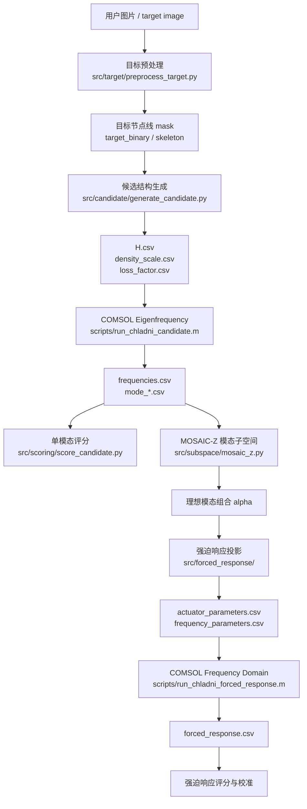

# ChladniPlateProject 算法逻辑与结构说明

本文档只解释当前项目的算法结构、数据流和主要问题，不修改任何代码。它的目的不是证明当前算法正确，而是把“现在到底在做什么”“每个模块的含义是什么”“为什么结果可能仍然不好”讲清楚，方便继续判断算法是否需要重构。

---

## 1. 一句话总览

当前项目的主线是：

> 用户输入目标图案，系统把图案转成节点线目标；再生成 15×15 的板厚度、密度缩放和损耗因子候选；然后让 COMSOL 计算模态或强迫响应；最后用图案匹配指标筛选结果。MOSAIC-Z 是在这个基础上新增的研究级方向：不再只看单个模态，而是尝试用多个模态的线性组合和强迫响应去塑造目标节点线。

现在需要补充一个重要原则：

> Python 不应再作为物理响应预测主线。Python 负责生成候选、调度 COMSOL、读取结果和评分；真实模态、频域响应和最终物理反馈应以 COMSOL 为准。

这意味着项目里实际上有两套思路并存：

1. 旧主线：生成结构候选，然后找一个单独 COMSOL eigenmode 像目标图案。
2. 新主线：把多个 eigenmodes 当成模态基底，通过模态组合、激励位置、频率和相位去形成目标低振幅线。

目前结果不理想的核心原因，很可能不是“迭代次数不够”，而是旧主线的物理自由度和搜索目标本身不够表达复杂 logo 式节点线。

---

## 2. 当前总流程



这个图里最重要的分界线是：

- `H.csv / density_scale.csv / loss_factor.csv` 会真正改变板的等效结构参数。
- `actuator_parameters.csv / frequency_parameters.csv` 会影响强迫响应。
- `support_parameters.csv / topology_primitives.csv` 目前需要特别小心理解，因为它们不一定已经以完整几何方式改变 COMSOL 模型。

---

## 3. 核心数据对象

| 数据对象 | 含义 | 当前作用 |
|---|---|---|
| `target_binary` | 用户图案预处理后的目标节点线或目标区域 | 所有评分和优化的参照物 |
| `H.csv` | 15×15 厚度场，单位通常是 mm | 改变 shell 厚度，是当前最主要结构变量 |
| `density_scale.csv` | 15×15 密度缩放场 | 改变局部质量分布 |
| `loss_factor.csv` | 15×15 损耗因子场 | 改变阻尼或等效损耗 |
| `material_parameters.csv` | 杨氏模量、泊松比、密度、热参数等 | 前端可调材料参数，传给 COMSOL |
| `mode_*.csv` | COMSOL 导出的某阶本征模态位移场 | 单模态评分和模态子空间优化的输入 |
| `frequencies.csv` | 各阶模态频率 | 选择模态、构造强迫响应分母 |
| `alpha` | MOSAIC-Z 的模态组合系数 | 表示多个模态如何线性叠加 |
| `actuator_parameters.csv` | 激励点位置、幅值、相位 | 用于强迫响应投影和 COMSOL frequency-domain |
| `frequency_parameters.csv` | 驱动频率和阻尼 | 用于强迫响应 |
| `topology_primitives.csv` | 槽、肋、质量块等结构基元描述 | 目前更像设计意图；只有被物化到几何或场变量后才真正改变算子 |

---

## 4. 用户图案如何变成目标

相关模块：`src/target/preprocess_target.py`

用户拖入图片后，系统大致做这些事：

1. 读入图片并转成灰度图。
2. 缩放到统一尺寸，例如 256×256。
3. 二值化，区分图案区域和背景区域。
4. 根据配置里的 `target_mode` 处理图案：
   - `chladni`：把图案骨架化，变成节点线目标。
   - `edge`：提取边缘，把边缘当目标。
   - `filled`：保留填充区域。
5. 对目标线做加粗处理，让评分不至于因为一两个像素偏差完全失败。
6. 去掉中心夹持区域，因为中心圆孔或夹具附近通常不应被当成有效目标。

这里有一个关键问题：

> 客户给的是 logo、文字或照片，但 Chladni 板最终显示的是低振幅节点线，不是普通像素图像。

所以预处理会把很多“面积图案”压缩成“线条目标”。例如 `IC` logo 的红色字母，本来是有笔画粗细和填充面的，但算法经常把它理解成应该出现的节点线骨架。这个转换本身就可能让用户视觉目标和物理目标发生偏差。

---

## 5. 候选结构如何生成

相关模块：`src/candidate/generate_candidate.py`

候选结构主要由三张 15×15 的表组成：

1. `H.csv`：厚度。
2. `density_scale.csv`：密度缩放。
3. `loss_factor.csv`：损耗因子。

配置中板尺寸是 150 mm × 150 mm，网格是 15×15，所以每个格子大约代表 10 mm × 10 mm 的区域。厚度当前是连续模式，范围大致是 0.6 mm 到 2.0 mm。

候选生成器里面有多种来源：

- 随机厚度场。
- 遗传算法变异和交叉。
- 以历史高分候选为锚点做扰动。
- `modal_compiler` 这类启发式生成器。
- 辅助密度和损耗场。
- 一些 surrogate / latent / KL proxy 方向的搜索。

但要注意：

> 这些方法大多仍然是在生成 `H / density / loss` 这种等效场变量，而不是直接做真实 CAD 拓扑优化。

也就是说，它们改变的是板的局部厚度、质量和损耗，而不是自然地产生真正的开槽、加强肋、可移动支撑、复杂边界形状等高影响结构变化。

---

## 6. `modal_compiler` 的真实含义

`modal_compiler` 听起来像是在使用 Kirchhoff-Love plate equation 反推厚度，但目前更准确的理解应该是：

> 它是一个基于目标图案和粗略模态直觉的启发式结构生成器，不是严格求解完整反问题的物理解析器。

它会尝试构造一个“目标线附近位移为零”的理想场，再根据这个理想场的曲率、梯度或局部特征去推测厚度应该怎么分布。

这个方向是有意义的，但它和真正的 Kirchhoff-Love 离散特征方程反问题还有明显差距。真正的本征问题是：

```text
K(p) phi = lambda M(p) phi
```

其中 `K` 和 `M` 是全局刚度和质量矩阵。某个位置的厚度变化不会只局部改变那里的节点线，而是会通过全局算子影响整个模态。因此，从目标图案直接反推出 `H.csv` 是一个高度非线性、全局耦合、可能多解或无解的问题。

---

## 7. COMSOL eigenfrequency 环节

相关脚本：`scripts/run_chladni_candidate.m`

Python 生成候选后，会把参数文件交给 COMSOL。COMSOL 做 eigenfrequency study，输出：

- `frequencies.csv`
- 多个 `mode_*.csv`

每个 mode 表示某一阶本征模态的位移分布。旧算法会在这些 mode 里逐个评分，试图找到一个最像目标图案的模态。

这条路径的隐含假设是：

> 某个自然本征模态本身就应该长得像用户目标。

这正是当前项目最容易卡住的地方。方板、中心夹持、自由边界和低维厚度扰动天然更容易产生中心环、放射状、星形、对称图案，而不是精确的 `IC` 字母或任意 logo。

---

## 8. 单模态评分逻辑

相关模块：

- `src/scoring/score_candidate.py`
- `src/scoring/metrics.py`

评分大致做这些事：

1. 读取每个 `mode_*.csv`。
2. 插值或栅格化成固定尺寸图像。
3. 从位移场中提取“接近零位移”的节点区域。
4. 去掉中心夹持区域。
5. 和目标图案计算各种指标。

常见指标包括：

| 指标 | 含义 |
|---|---|
| IoU | 模拟节点区域和目标区域的交并比 |
| Dice | 两者重叠程度，线图案中比 IoU 稍稳定 |
| Chamfer | 模拟线和目标线之间的距离 |
| Precision / Recall | 模拟出来的线是否多余，目标线是否覆盖到 |
| Layout | 位置、范围、构图是否接近 |
| Complexity | 图案复杂度是否和目标接近 |
| Center penalty | 是否过度依赖中心孔附近的假匹配 |

最终分数不是单纯的 IoU 或 Dice，而是多项指标和惩罚项的组合。

问题在于：

> 对线状图案来说，阈值提取出来的节点区域非常敏感。位移阈值稍微变一点，IoU 和 Dice 可能大幅变化。

另外，如果最终分数加入了平滑度、质量、频率等惩罚，算法可能偏向“物理上规整但视觉上不够像”的候选。

---

## 9. MOSAIC-Z：模态子空间逻辑

相关模块：

- `src/subspace/mosaic_z.py`
- `src/scoring/signed_distance_loss.py`

MOSAIC-Z 的第一层不是生成新结构，而是问一个更基础的问题：

> 对于同一个 COMSOL 候选结构，如果不只看单个 mode，而是允许多个 mode 线性组合，它是否有能力组合出目标图案？

数学形式是：

```text
u = alpha_1 * mode_1 + alpha_2 * mode_2 + ... + alpha_n * mode_n
```

其中 `alpha` 是要优化的系数。

这一步的意义很大，因为它把搜索空间从“几十张固定模态图”扩展成“这些模态张成的连续空间”。

如果 MOSAIC-Z 能组合出像目标的图案，说明结构本身可能不是完全没潜力，而是旧算法只看单个 mode 太窄了。如果 MOSAIC-Z 也组合不出来，说明当前结构的模态基底本身表达能力不足，需要改变结构算子。

---

## 10. Signed-distance zero-contour loss

相关模块：`src/scoring/signed_distance_loss.py`

MOSAIC-Z 不应该主要用普通 IoU 当训练目标，因为 IoU 对节点线太硬。它使用更平滑的零线损失，核心想法是：

1. 目标线上，位移应该接近零。
2. 远离目标的位置，不应该出现大量额外零线。
3. 目标线两侧最好出现符号穿越，说明它真的是节点线。
4. 节点线不应该是一大片模糊的低振幅区域，而应该有足够梯度。

这比旧的 threshold-IoU 更适合优化，但它仍然有一个限制：

> 它优化的是数学上的模态组合，不一定保证这个组合能被真实激励器激发出来。

所以 MOSAIC-Z 第一层只能回答“模态空间是否有表达能力”，不能单独证明实验可实现。

---

## 11. 强迫响应逻辑

相关模块：

- `src/forced_response/modal_response_coefficients.py`
- `src/forced_response/actuator_projection.py`
- `src/forced_response/optimize_actuators.py`

真实 Chladni 实验往往不是直接观察一个纯 eigenmode，而是在某个频率下用激励器驱动板。响应可以近似看成多个模态的叠加：

```text
u(omega) = sum_k a_k(omega) * phi_k
```

其中每个模态权重 `a_k` 受这些因素影响：

- 驱动频率。
- 激励点位置。
- 激励幅值。
- 激励相位。
- 阻尼。
- 模态频率。

当前项目里有两种相关策略：

1. `actuator_projection`：先有一个理想 `alpha`，然后寻找激励器配置去逼近它。
2. `optimize_actuators`：直接优化激励器位置、频率、相位，让预测的强迫响应低振幅线贴近目标。

这条路线是正确的突破方向，但当前实现仍是近似模型。

---

## 12. 强迫响应近似模型的问题

`modal_response_coefficients.py` 里会根据模态频率、阻尼、激励位置和相位计算复数模态系数。它的核心结构类似：

```text
a_k = modal_participation / modal_denominator
```

其中：

- `modal_participation` 由激励点处的模态值决定。
- `modal_denominator` 由模态频率、驱动频率和阻尼决定。

这个模型很有用，但需要注意几个问题：

1. 它把激励器近似成点激励或局部采样。
2. 它依赖导出的模态是否已经正确归一化。
3. 它没有完整使用真实 COMSOL 的质量归一化、力单位和接触耦合。
4. 它通常会归一化系数向量，所以更关注图案形状，而不是绝对振幅。
5. 它只使用有限阶模态，截断误差可能影响图案。
6. 它对阻尼的假设很粗。

因此 Python 里的 forced-response 预测容易看起来很好，但真实 COMSOL frequency-domain 结果不一定跟上。

这正是之前出现过的情况：Python 预测的六激励器或八激励器结果看起来更好，但真实 COMSOL 验证后 Dice 明显下降。

因此后续应把这类 Python 预测从“主决策依据”降级为“诊断或候选生成参考”。关键判断必须回到 COMSOL 输出的 eigenfrequency 或 frequency-domain 结果。

---

## 13. 校准层的意义

相关模块：`src/forced_response/calibrate_modal_response.py`

校准层的作用是：

> 用真实 COMSOL forced response 反推“Python 模态响应模型哪里偏了”，然后给每个模态加一个复数缩放因子。

这样可以修正一部分相位、幅值和模态参与误差。

已有经验显示，校准后真实结果确实有提升。例如从较弱的 direct forced response 提升到更好的 calibrated frequency scan。但这也暴露出另一个问题：

> 一个全局的 per-mode scale 仍然太粗，因为误差可能依赖频率、激励位置、激励数量、载荷分布和结构候选本身。

所以校准是必要的，但不是最终解法。

---

## 14. 拓扑变量目前到底是什么

相关模块：

- `src/topology_grammar/rasterize.py`
- `scripts/materialize_topology_candidate.py`

研究报告建议加入 slot、rib、mass pad、support offset 等 topology-like variables。它们的本意是改变结构算子，让模态基底更有表达能力。

但这里必须分清三层：

1. 文本层：`topology_primitives.csv` 描述了槽、肋、质量块的意图。
2. 场变量层：把这些 primitive 栅格化成 `H.csv / density_scale.csv / loss_factor.csv` 的变化。
3. 真实几何层：在 COMSOL CAD 几何里真的开槽、加肋、加质量块或改变夹持。

目前更接近第 2 层，而不是完整第 3 层。也就是说，槽和肋可能被转化成等效厚度、密度或损耗变化，但还不是严格的真实几何开槽/加肋。

这会限制突破力度。因为 15×15 网格很粗，很多细长 slot/rib 在栅格化后会变成模糊的几块厚度变化，很难产生真实拓扑几何的强烈作用。

---

## 15. 支撑参数需要特别警惕

`support_parameters.csv` 代表支撑或夹持参数，例如中心位置和半径。

但 COMSOL 里的固定约束通常绑定的是几何实体选择，而不是自动根据 CSV 改变的数学圆域。如果 COMSOL MPH 模型没有把固定约束写成参数化选择，那么 Python 改了 support 参数也不会真正移动夹持。

所以当前必须把它当成一个高风险点：

> 支撑参数如果没有和 COMSOL 几何选择绑定，它就是日志或意图，不是真正的物理变量。

这会导致算法以为自己在探索 support offset，但真实仿真仍然是中心固定。

---

## 16. 当前实测经验

截至目前，已有经验大致是：

| 阶段 | 结果含义 |
|---|---|
| 旧单模态搜索 | 大量真实 COMSOL 候选后，最好结果仍很低，说明单模态路线受限 |
| MOSAIC-Z free subspace | 能显著超过单模态，说明模态组合有潜力 |
| Python direct forced response | 预测结果有时很好，但真实 COMSOL 验证会明显缩水 |
| calibrated forced response | 比直接强迫响应更可靠，说明校准有价值 |
| frequency scan | 当前能取得相对更好的真实结果 |
| 栅格化 topology seeds | 已经能改变 COMSOL 响应，但当前 seed 没有超过最好 baseline |

这说明：

1. MOSAIC-Z 的思想方向是有价值的。
2. Python forced-response surrogate 还不够可信。
3. 当前拓扑物化太弱或太粗，尚未真正完成 operator sculpting 的突破。
4. 继续只做小范围频率/相位微调，可能会很快进入收益递减。

---

## 17. 当前算法最可能的问题

### 17.1 目标语义不一致

用户想要的是“看起来像 IC 的图案”，但算法实际优化的是“节点线或低振幅线贴近预处理后的 skeleton”。这两者不是完全相同的东西。

如果目标是 logo 面积，节点线只能显示线条，那么必须明确：

- 是显示 logo 的外轮廓？
- 是显示 logo 的骨架？
- 是显示 logo 的负形区域？
- 还是显示一种视觉上像 logo 的沙粒聚集区域？

如果目标定义不清，算法会优化一个和用户直觉不同的对象。

### 17.2 旧结构变量合同太弱

只靠厚度、密度、损耗场，尤其是 15×15 的粗网格，很难稳定生成复杂字母节点线。

厚度场可以弯曲模态，但不一定能创造目标拓扑。复杂 logo 可能需要：

- 真实开槽。
- 加强肋。
- 局部质量块。
- 非中心支撑。
- 多点激励。
- 参数化边界扰动。

### 17.3 模态组合和真实激励之间有断层

MOSAIC-Z free subspace 可以找到漂亮的 `alpha`，但真实系统不能直接指定 `alpha`。真实可控变量是激励位置、频率、相位和结构。

所以必须区分：

- 数学可表达。
- 激励器可实现。
- COMSOL frequency-domain 可验证。
- 实验硬件可复现。

这四层不能混成一个结果。

### 17.4 Python surrogate 对 COMSOL 排名不够可靠

如果 Python 预测高分，但 COMSOL 低分，说明 surrogate 还不能指导昂贵搜索。

可能原因包括：

- 模态归一化不一致。
- 阻尼模型太粗。
- 载荷模型太理想。
- 激励器和板的真实耦合没有建模。
- 有限模态截断。
- COMSOL 后处理和 Python 阈值不一致。

### 17.5 支撑和拓扑可能没有完全进入真实物理模型

如果 support offset 没有真正改 COMSOL 固定约束，或者 topology primitive 只是在 CSV 里存在，那算法会产生“我已经扩大物理自由度”的错觉。

这类 no-op 或 weak-op 变量会严重误导搜索。

### 17.6 评分函数容易鼓励错误形状

当前评分混合了很多指标。它可以避免某些坏情况，但也可能让算法在“中心 blob”“放射状星形”“一条斜带”之间找到局部最优，而不是强迫它真的追求 `IC`。

尤其是线图案里，IoU/Dice 对阈值和线宽很敏感。图案视觉上明显不像时，某些数值指标仍可能看起来有进步。

---

## 18. 当前代码结构地图

| 路径 | 主要含义 |
|---|---|
| `config.yaml` | 项目全局配置，包括板尺寸、网格、材料、COMSOL 路径、评分参数、优化参数 |
| `src/target/preprocess_target.py` | 把用户图像转成可优化的目标 mask / skeleton |
| `src/candidate/generate_candidate.py` | 生成候选厚度、密度、损耗场 |
| `src/scoring/score_candidate.py` | 读取 COMSOL 模态，提取节点线并计算候选分数 |
| `src/scoring/metrics.py` | IoU、Dice、Chamfer、layout 等指标 |
| `src/scoring/signed_distance_loss.py` | MOSAIC-Z 用的可微零线损失 |
| `src/scoring/amplitude_valley_loss.py` | 强迫响应低振幅谷线损失 |
| `src/subspace/mosaic_z.py` | 模态子空间组合优化 |
| `src/forced_response/modal_response_coefficients.py` | 根据频率和激励器估计模态响应系数 |
| `src/forced_response/actuator_projection.py` | 把理想 alpha 投影到物理激励器参数 |
| `src/forced_response/optimize_actuators.py` | 直接优化激励器使强迫响应贴近目标 |
| `src/forced_response/calibrate_modal_response.py` | 用 COMSOL forced response 校准 Python 模态响应模型 |
| `src/topology_grammar/rasterize.py` | 把 slot/rib/mass pad 等 primitive 栅格化成等效场变量 |
| `scripts/run_chladni_candidate.m` | COMSOL eigenfrequency runner |
| `scripts/run_chladni_forced_response.m` | COMSOL frequency-domain runner |
| `scripts/materialize_topology_candidate.py` | 把 topology primitive 物化成候选场文件 |

---

## 19. 应该如何判断下一步是否有效

一个更清晰的判断顺序应该是：

1. 先确认目标定义：用户图案到底要变成节点线、轮廓线、骨架线还是低振幅面积。
2. 对已有候选做 MOSAIC-Z subspace feasibility，判断当前模态基底是否能表达目标。
3. 如果 free subspace 可行，再做 forced-response projection，并用少量 COMSOL frequency-domain 验证。
4. 如果 free subspace 不可行，说明当前结构算子不够，应该改变真实结构，而不是继续调频率。
5. 改结构时，优先让 COMSOL 真实吃到变量：真实 slot/rib/mass pad 几何，或至少经过验证的等效厚度/密度物化。
6. 每做一个新结构家族，都要重新导出 eigenmodes，再跑 subspace feasibility，而不是只沿用旧模态基底。
7. 用真实 COMSOL 结果校准 surrogate，并检查 surrogate 是否能正确排序候选。

---

## 20. 当前不应该过度相信的东西

以下结果可以参考，但不应当被当成最终证明：

1. Python 里很好看的 free modal combination。
2. 没有 COMSOL 验证的 actuator optimization。
3. 没有真正改变 COMSOL 几何或约束的 topology/support 参数。
4. 只比 baseline 好一点点的 frequency scan。
5. 单一 Dice 或 IoU 数字。
6. 只在 IC 目标上调出来的规则，直接推广到任意客户图案。

---

## 21. 更诚实的当前结论

当前项目已经从普通“生成厚度场 + 找最佳本征模态”推进到了“模态子空间 + 强迫响应 + 初步拓扑物化”的阶段。这个方向是正确的，但目前还没有完全完成研究报告中说的革命性切换。

真正还缺的关键环节是：

1. 把 topology 和 support 变成真正改变 COMSOL 算子的变量。
2. 让 forced-response surrogate 与真实 COMSOL frequency-domain 更一致。
3. 明确用户图案和 Chladni 节点线之间的语义映射。
4. 用 subspace feasibility 作为结构家族筛选工具，而不是继续盲目堆候选。
5. 从“优化某个候选的频率和激励”升级到“优化可激发的模态响应空间”。

如果一句话说当前算法的主要毛病：

> 现在系统已经开始走向 MOSAIC-Z，但很多模块仍然保留旧算法的惯性：结构变量偏弱、真实物理约束进入不充分、Python 预测和 COMSOL 真实响应之间还有断层，所以会出现看似不断升级，实则仍在同一物理表达空间里兜圈的风险。

结合最新判断，后续更准确的主线应该是：

> Python 生成目标对齐的被动板件几何，COMSOL 负责真实模态和频域仿真，Python 只对 COMSOL 输出进行评分和调度。不要再让 Python 简化响应模型承担现实反馈的角色。
