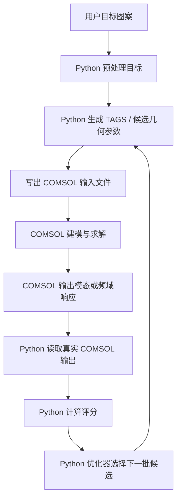

# COMSOL-first 仿真原则说明

本文档记录一个新的项目原则：后续算法不应再依赖 Python 里的简化物理预测作为主判断依据。Python 仍然非常重要，但它的职责应该是生成、调度、评分和整理；真正的模态仿真、频域响应和物理反馈必须由 COMSOL 给出。

---

## 1. 为什么要停止 Python 预测主线

之前项目里曾尝试用 Python 根据 COMSOL 导出的模态，近似计算强迫响应：

```text
COMSOL eigenmodes -> Python modal response approximation -> Python predicted forced response
```

这个方向的优点是快，但问题也很明显：

1. Python 模型必然简化真实 COMSOL 物理。
2. 模态归一化、阻尼、载荷分布和接触耦合都可能不一致。
3. Python 预测看起来更好时，真实 COMSOL 验证不一定跟上。
4. 它会误导搜索，把计算预算花在“Python 看起来优秀但 COMSOL 不认可”的候选上。
5. 对最终软件来说，用户需要的是 COMSOL 真实反馈，而不是 Python 近似图。

所以后续主线应避免：

```text
Python 预测结果很好 -> 认为候选很好
```

而应该改成：

```text
COMSOL 仿真结果很好 -> 候选才算真的好
```

---

## 2. 新的职责边界

### Python 应该负责什么

Python 仍然是项目的控制中心，但它不应伪装成物理求解器。

Python 负责：

| 职责 | 说明 |
|---|---|
| 用户图片预处理 | 把图片转成目标 mask、骨架线、距离场 |
| 候选几何生成 | 生成厚度场、目标对齐几何、TAGS 参数、材料参数 |
| COMSOL 输入文件 | 写出 `H.csv`、材料参数、几何参数、频率扫描参数 |
| 调度 COMSOL | 启动 COMSOL LiveLink / MATLAB runner / batch runner |
| 读取 COMSOL 输出 | 解析 `mode_*.csv`、`forced_response.csv`、频率数据 |
| 评分 | 对 COMSOL 输出结果计算 valley score、IoU、Dice、Chamfer |
| 优化策略 | 根据真实 COMSOL 分数决定下一批候选 |
| 前端展示 | 展示目标、COMSOL 结果、评分数据、候选结构 |
| 报告与日志 | 保存实验历史、失败原因、候选排行 |

### COMSOL 应该负责什么

COMSOL 是唯一可信的物理反馈来源。

COMSOL 负责：

| 职责 | 说明 |
|---|---|
| 几何建模 | 板、下表面结构、厚度、中心固定区 |
| 材料建模 | 杨氏模量、泊松比、密度、热参数、阻尼 |
| 边界条件 | 中心固定、自由边界、载荷约束 |
| Eigenfrequency | 真实本征模态和频率 |
| Frequency Domain | 真实扫频强迫响应 |
| 上表面位移输出 | 真实 `u_z` 或 `|u_z|` 分布 |
| 物理一致性 | 所有最终候选必须通过 COMSOL 验证 |

---

## 3. 什么可以保留，什么要降级

### 可以保留的 Python 计算

这些不是问题，因为它们不替代 COMSOL 物理：

```text
1. 图像处理；
2. 骨架提取；
3. 距离场计算；
4. TAGS 几何参数生成；
5. 候选批量生成；
6. COMSOL 输出后的图案评分；
7. 优化器根据真实分数选择下一批候选；
8. 前端可视化；
9. 报告生成。
```

### 应该降级的 Python 物理预测

这些可以保留为诊断或快速 sanity check，但不能作为主线决策依据：

```text
1. Python modal-response coefficient predictor；
2. Python predicted forced response；
3. 只用 Python 组合模态图就判断候选成功；
4. 只用 Python surrogate 排名决定最终候选；
5. 只看 Python predicted Dice / IoU。
```

它们最多回答：

> 这个方向可能值得试一下。

但不能回答：

> 这个候选真实可行。

---

## 4. 新的主流程

后续主流程应改成 COMSOL-in-the-loop：



这个流程里，Python 可以很聪明，但它不能替代 COMSOL 产生响应图。

---

## 5. 对 MOSAIC-Z 的重新定位

MOSAIC-Z 的核心思想仍然有价值，但要重新定位。

原先可能会走成：

```text
COMSOL modes -> Python 组合 / Python 强迫响应预测 -> 认为图案可行
```

现在应该改成：

```text
COMSOL modes -> Python 分析表达潜力 -> 生成更好的 COMSOL 候选 -> COMSOL frequency-domain 验证
```

也就是说，MOSAIC-Z 里的 Python 模态子空间不应该是最终物理结果，而应该是：

1. 诊断当前结构是否有表达潜力。
2. 指导下一批被动几何如何调整。
3. 帮助选择值得 COMSOL 验证的候选。

最终结论必须来自 COMSOL。

---

## 6. 对 TAGS 的影响

TAGS 的方向更加适合 COMSOL-first 原则。

TAGS 不需要 Python 去预测真实响应。它只需要 Python 生成目标对齐几何：

```text
target skeleton -> underside thickness / groove / rib parameters
```

然后交给 COMSOL 做真实仿真：

```text
COMSOL eigenfrequency / frequency-domain -> real response field
```

Python 再负责评分：

```text
real COMSOL response -> target valley score
```

这比 Python forced-response surrogate 更干净，也更符合项目目标。

---

## 7. 对优化策略的影响

后续优化不应追求“Python 里一次生成几千个预测候选”，而应追求：

> 用尽量少但真实的 COMSOL 调用，探索更有意义的被动几何空间。

推荐策略：

1. Python 生成少量高质量 TAGS 候选。
2. 每个候选都跑 COMSOL。
3. Python 只根据 COMSOL 真实结果更新候选。
4. 不让 Python surrogate 替代 COMSOL 排名。
5. 如果要用代理模型，只能用于候选优先级排序，且必须持续用 COMSOL 结果校正。

可以接受的代理模型用法是：

```text
代理模型建议哪些候选值得跑 COMSOL
```

不可以接受的是：

```text
代理模型直接宣布哪个候选成功
```

---

## 8. 对软件产品的影响

最终软件应该给用户的体验是：

```text
用户上传图案
-> Python 生成板件候选和 COMSOL 输入
-> COMSOL 自动仿真
-> Python 展示 COMSOL 结果和评分
-> 用户看到真实仿真反馈
```

而不是：

```text
用户上传图案
-> Python 生成一个近似预测图
-> 用户误以为这是 COMSOL 真实结果
```

前端也应该清楚区分：

| 显示项 | 是否可信 |
|---|---|
| COMSOL mode / forced response | 真实仿真结果 |
| Python generated geometry preview | 候选结构预览 |
| Python score of COMSOL output | 可信评分 |
| Python predicted response | 仅诊断，不应作为最终展示主图 |

---

## 9. 当前报告中的判断修正

结合这个原则，当前算法判断应改成：

> Python 的高级算法不应该继续试图成为物理现实的替代品。它应该把复杂目标转换成更好的被动几何候选，然后让 COMSOL 给出真实反馈。项目真正需要的是 COMSOL-first 的闭环优化，而不是 Python-first 的近似预测。

这也意味着，后续优先级应调整为：

1. 建立 TAGS 目标对齐被动几何生成。
2. 确保这些几何真的进入 COMSOL 模型。
3. 用 COMSOL frequency-domain 或 eigenfrequency 得到真实响应。
4. Python 评分 COMSOL 输出。
5. 根据真实分数更新下一批几何。

---

## 10. 最终结论

一句话总结：

> Python 负责想、生成、调度和评分；COMSOL 负责物理现实。

更具体地说：

> 后续不要再把 Python forced-response prediction 当主线。Python 可以生成 TAGS 候选，但每个关键判断都必须回到 COMSOL 仿真结果。

