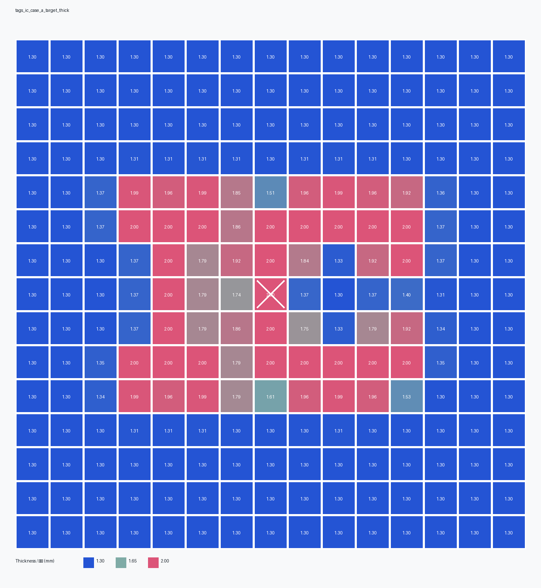
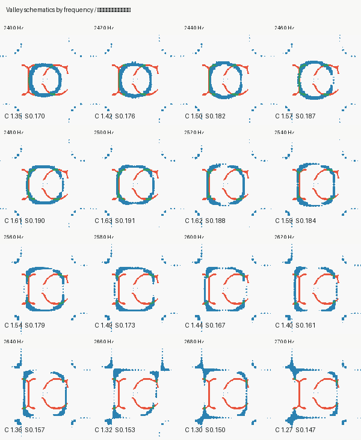

# 不同频率图案对应的板厚参数

## 一句话结论

刚刚跑的 `240-270 Hz` 频率精扫，使用的是**同一块板**：

- 厚度矩阵完全相同；
- 材料参数完全相同；
- 阻尼参数相同；
- 激励区域参数相同；
- 只有 `drive_frequency_hz` 不同。

所以这些图案的差异来自：**同一块变厚度板在不同驱动频率下的频域响应不同**，不是每个频率都换了一套厚度。

## 厚度可视化

下面这张图就是本轮所有频率共同使用的 15×15 厚度矩阵。



## 每个频率的波谷图案

下面这张图显示同一块板在不同频率下形成的低振幅波谷核心。红色是目标 IC，蓝色是该频率下的低振幅波谷，绿色是重合处。



## 板子基础参数

| 项目 | 数值 |
|---|---:|
| 板尺寸 | 150 mm × 150 mm |
| 网格 | 15 × 15 |
| 单格尺寸 | 10 mm × 10 mm |
| 最小厚度 | 1.300 mm |
| 最大厚度 | 2.000 mm |
| 平均厚度 | 1.454 mm |
| 厚度标准差 | 0.269 mm |
| 厚度模式 | continuous |
| 设计逻辑 | target-aligned passive geometry，目标骨架带加厚 |

## 材料参数

| 参数 | 数值 |
|---|---:|
| 密度 | 1200 kg/m^3 |
| 杨氏模量 | 2.0e9 Pa |
| 泊松比 | 0.35 |
| 热导率 | 0.18 W/(m*K) |
| 比热容 | 1200 J/(kg*K) |
| 热膨胀系数 | 8e-05 1/K |

## 频率扫描参数

| 频率 | 厚度矩阵 | 阻尼比 | 激励半径 |
|---:|---|---:|---:|
| 240 Hz | 同一份 H.csv | 0.015 | 2.5 mm |
| 242 Hz | 同一份 H.csv | 0.015 | 2.5 mm |
| 244 Hz | 同一份 H.csv | 0.015 | 2.5 mm |
| 246 Hz | 同一份 H.csv | 0.015 | 2.5 mm |
| 248 Hz | 同一份 H.csv | 0.015 | 2.5 mm |
| 250 Hz | 同一份 H.csv | 0.015 | 2.5 mm |
| 252 Hz | 同一份 H.csv | 0.015 | 2.5 mm |
| 254 Hz | 同一份 H.csv | 0.015 | 2.5 mm |
| 256 Hz | 同一份 H.csv | 0.015 | 2.5 mm |
| 258 Hz | 同一份 H.csv | 0.015 | 2.5 mm |
| 260 Hz | 同一份 H.csv | 0.015 | 2.5 mm |
| 262 Hz | 同一份 H.csv | 0.015 | 2.5 mm |
| 264 Hz | 同一份 H.csv | 0.015 | 2.5 mm |
| 266 Hz | 同一份 H.csv | 0.015 | 2.5 mm |
| 268 Hz | 同一份 H.csv | 0.015 | 2.5 mm |
| 270 Hz | 同一份 H.csv | 0.015 | 2.5 mm |

厚度文件一致性校验：

```text
H.csv SHA256 = 65ce99a40a3a45abbde039e55c962868d741219d4e5fa79fa091fc96aebc0d1d
```

## 15×15 厚度矩阵

单位：mm。

```text
1.300,1.300,1.300,1.300,1.300,1.300,1.300,1.300,1.300,1.300,1.300,1.300,1.300,1.300,1.300
1.300,1.300,1.300,1.300,1.300,1.300,1.300,1.300,1.300,1.300,1.300,1.300,1.300,1.300,1.300
1.300,1.300,1.300,1.300,1.300,1.300,1.300,1.300,1.300,1.300,1.300,1.300,1.300,1.300,1.300
1.300,1.300,1.301,1.308,1.307,1.308,1.306,1.300,1.307,1.308,1.307,1.303,1.300,1.300,1.300
1.300,1.300,1.366,1.990,1.962,1.990,1.853,1.515,1.962,1.990,1.962,1.918,1.359,1.300,1.300
1.300,1.300,1.367,2.000,2.000,2.000,1.861,2.000,2.000,2.000,2.000,2.000,1.367,1.300,1.300
1.300,1.300,1.301,1.367,2.000,1.795,1.918,2.000,1.845,1.329,1.918,2.000,1.367,1.300,1.300
1.300,1.300,1.300,1.367,2.000,1.795,1.737,2.000,1.374,1.300,1.367,1.395,1.309,1.300,1.300
1.300,1.300,1.301,1.367,2.000,1.795,1.861,2.000,1.749,1.334,1.795,1.918,1.341,1.300,1.300
1.300,1.300,1.346,2.000,2.000,2.000,1.795,2.000,2.000,2.000,2.000,2.000,1.346,1.300,1.300
1.300,1.300,1.345,1.990,1.962,1.990,1.788,1.613,1.962,1.990,1.962,1.530,1.302,1.300,1.300
1.300,1.300,1.301,1.308,1.306,1.308,1.305,1.301,1.305,1.308,1.305,1.300,1.300,1.300,1.300
1.300,1.300,1.300,1.300,1.300,1.300,1.300,1.300,1.300,1.300,1.300,1.300,1.300,1.300,1.300
1.300,1.300,1.300,1.300,1.300,1.300,1.300,1.300,1.300,1.300,1.300,1.300,1.300,1.300,1.300
1.300,1.300,1.300,1.300,1.300,1.300,1.300,1.300,1.300,1.300,1.300,1.300,1.300,1.300,1.300
```

## 怎么理解这张板

这是一块 TAGS-A 板：目标 IC 骨架附近的下表面被动加厚，背景区域保持接近 `1.300 mm`。

本轮频域验证问的问题是：

> 这同一块板，在中心激励、不同驱动频率下，能不能自然出现接近 IC 的低振幅波谷？

目前最好的频率是 `250 Hz`，但它只是弱可行：C 的环状波谷比较明显，I 左侧有部分重合，还没有形成干净完整的 IC。

